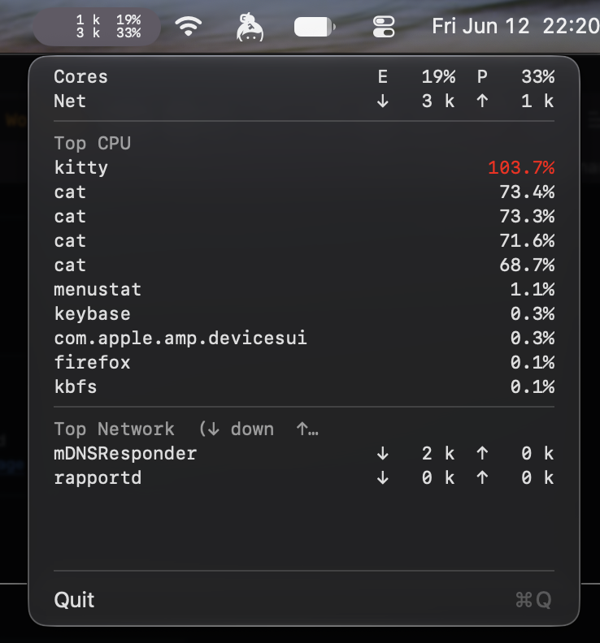

# menustat

A small macOS menu bar app for keeping an eye on CPU and network activity.



Build and run with Apple's Command Line Tools; the Xcode app is optional:

```sh
bash build.sh
open build/menustat.app
```

The script produces an optimized app for this Mac's architecture, with a local
ad-hoc signature and a macOS 15 minimum. Quit an already-running copy before
launching the new build. You can also build the project with Xcode.

Run sampling regression tests and an optimized compile/link check with `bash tests/run.sh`.
Use `RUN_LIVE=1 bash tests/run.sh` to also exercise live CPU/network sampling and menu lifecycle
in a logged-in macOS GUI session.
